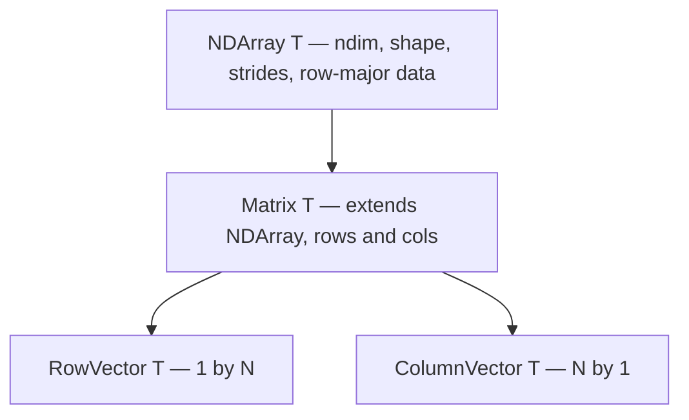

# cppmatrix: architecture and optimizations

This document describes how the **cppmatrix** header-only-style library is organized, how the main types relate to each other, and which performance techniques are used. It includes short C++ snippets so expectations about overload resolution, templates, and build flags stay clear.

---

## 1. Repository layout

| Location | Role |
|----------|------|
| `include/` | All library code: templates and inline functions only (no separate `.cpp` for the core). |
| `include/cppmatrix.h` | Umbrella header: include this to pull in the public API. |
| `tests/` | GoogleTest sources; `tests.cpp` concatenates them into one executable. |
| `CMakeLists.txt` | Builds `run_tests`, wires BLAS/LAPACK/OpenMP, and toggles optional optimizations. |

**Include order matters only insofar as `cppmatrix.h` already orders dependencies** (e.g. `matrix.h` before `vector.h` because `function.h` can depend on matrices and vectors).

---

## 2. Layered type model

The design stacks **one-dimensional storage** with **N-dimensional indexing** on top, then specializes for 2D matrices and 1D vectors.



### 2.1 `NDArray<T>` (`include/ndarray.h`)

- **Constraint:** `T` must be a floating-point type (`std::is_floating_point_v<T>`).
- **Storage:** A single contiguous buffer, **row-major**, with **64-byte alignment** for the data pointer (good for SIMD and cache line alignment).
- **Shape and strides:** On allocation, the implementation computes row-major strides so multi-index access is **O(ndim)** per element, not repeated products over dimensions:

```cpp
// Conceptual stride computation (see `_allocate` in ndarray.h)
strides[ndim - 1] = 1;
for (int64_t i = ndim - 2; i >= 0; --i)
    strides[i] = strides[i + 1] * shape[i + 1];
```

- **Indexing:** `operator()(uint64_t (&index)[ndim])` folds indices with strides into one linear offset.
- **Indexing safety:** The implementation now supports `operator()(std::span<const uint64_t>)` and the fixed-size array overload forwards to it. A rank mismatch where the provided index has fewer elements than `ndim()` throws `std::out_of_range` to avoid UB. Use `at(...)` for explicit bounds checking.
- **Aliasing:** The data pointer is declared with a portable **restrict** macro (`CPPMATRIX_RESTRICT`) to help the compiler assume non-aliasing when optimizing loops.

### 2.2 `Matrix<T>` (`include/matrix.h`)

- **2D view** on top of `NDArray`: stores `_rows` and `_cols` and exposes `operator()(row, col)` by building a 2-index array and delegating to `NDArray`.
- **Elementwise** add/subtract and similar use `std::transform` over `.data()` when both operands are matrices of the same shape.
- **Matrix multiply** is the critical path; see [§4](#4-numerical-kernels-blas-and-fallbacks).

### 2.3 `RowVector<T>` and `ColumnVector<T>`

- **`RowVector`:** `1 × N` matrix; `RowVector(const Matrix&)` requires a single row.
- **`ColumnVector`:** `N × 1` matrix; constructor requires a single column.
- **Transpose** swaps representation: implementations live in `include/vector.h` (out-of-line templates) and return the **other** vector type by copying the underlying contiguous data (with optional OpenMP for very long vectors).

### 2.4 Polymorphism caveat (important in C++)

`Matrix::transpose()` returns `Matrix<T>`. **`ColumnVector::transpose()` and `RowVector::transpose()` are separate overloads** that return `RowVector` / `ColumnVector`. If you call `transpose()` on a **`Matrix&` or `Matrix*`** that actually refers to a column vector, **static typing** selects `Matrix::transpose()`, so you get a generic `Matrix` (correct **shape**, but not the strong `RowVector` type). Use the concrete vector type or the free `transpose` overloads in `vector.h` when you need the distinguished vector types.

---

## 3. Function objects and algorithms

### 3.1 `function.h`: concepts and `BaseFunction`

The library uses **concepts** (`IsRealFunction`, `IsScalarField`, `IsVectorField`) tied to inheritance from templated `BaseFunction` specializations:

- **Real:** \(\mathbb{R} \to \mathbb{R}\)
- **Scalar field:** \(\mathbb{R}^n \to \mathbb{R}\) with derivatives as `ColumnVector` / `Matrix` as appropriate
- **Vector field:** \(\mathbb{R}^n \to \mathbb{R}^n\)

Associated types (`PrecisionT`, `InputT`, `ValueT`, derivative types) come from **`FunctionTraits<F>`** partial specializations keyed by the concrete base (`RealFunction<float>`, `ScalarField<double>`, etc.), not from static data members.

`operator()`, `d1`, and `d2` are **`const`** member functions. Where an API still needs a type-erased callable, **`copy_callable(f)`** stores an **owned copy** of `f` in a `std::function`. **`get_function()`** captures `this` and is unsafe after the object is destroyed.

### 3.2 Integration (`include/integration.h`)

1D quadrature mirrors **newton.h**: **`template<IsRealFunction F>`** classes **`Riemann1DIntegrator`**, **`Trapezoidal1DIntegrator`**, **`Simpson1DIntegrator`** take **`(const F& f, lb, ub, n)`**, keep a copy **`F _f`** (like **`Newton`**’s functor member), and expose **`PrecisionT<F> run()`** with no `std::function` argument. **`Base1DIntegrator<P>`** only holds the interval and **`n()`** subinterval count (not to be confused with Newton’s max-iteration **`n()`**). OpenMP **`reduction(+:result)`** is used on the accumulation loops when enabled.

### 3.3 Root finding (`include/newton.h`)

- **`Newton` / `Polyak`:** Iterative updates for scalar problems.
- **`ParallelNewton` / `ParallelPolyak`:** Run many independent starts; each start is one solver run, then the implementation picks the result with the **smallest residual** (OpenMP parallel for loop over starts).

### 3.4 Placeholder headers

`ode.h` and `process.h` are currently **empty include guards only**—placeholders for future ODE/process APIs.

---

## 4. Numerical kernels: BLAS and fallbacks

### 4.1 Matrix × matrix

For `float` and `double`, multiplication uses **CBLAS** `cblas_sgemm` / `cblas_dgemm` with **row-major** layout (`CblasRowMajor`, `CblasNoTrans`):

```cpp
// matrix.h — pattern for double (float is analogous with cblas_sgemm)
cblas_dgemm(CblasRowMajor, CblasNoTrans, CblasNoTrans,
            C.rows(), C.cols(), left.cols(),
            1.0, left.data(), left.cols(),
            right.data(), right.cols(),
            0.0, C.data(), C.cols());
```

**Why this matters:** Leading dimensions passed to BLAS (`left.cols()`, `right.cols()`, `C.cols()`) must match **row-major** storage: consecutive elements in a row are contiguous.

For **other** `T`, `multiply_naive` implements a triple loop with:

- OpenMP **parallel collapse(2)** over output rows/columns when enabled.
- Inner loop with **`omp simd reduction(+:acc)`** to encourage vectorization of the dot product along \(k\).

### 4.2 Vectors and matrix–vector products

- **Dot product** `dot(RowVector, ColumnVector)`:
  - `float` / `double`: **`cblas_sdot` / `cblas_ddot`** (template specializations in `vector.h`).
  - Other types: `std::inner_product` or an OpenMP parallel reduction for large sizes.
- **Matrix–vector** products in `row_vector.h` / `column_vector.h` use **`cblas_sgemv` / `cblas_dgemv`** for `float`/`double` with the correct transpose flag for row vs column layout.

---

## 5. Parallelism: OpenMP

When `CPPMATRIX_USE_OPENMP` is defined (as in the test target in `CMakeLists.txt`), the library uses OpenMP in many hot paths, for example:

- NDArray elementwise `operator+=` / similar: `#pragma omp parallel for simd`
- Matrix transpose: `#pragma omp parallel for collapse(2)` over **blocks** (see below)
- `multiply_naive`: parallel outer loops + SIMD inner reduction
- Integration: `parallel for reduction`
- Batch operations: `parallel for` (and `schedule(dynamic)` for batch multiply)
- Expression evaluation: `collapse(2)` over `(i,j)` when evaluating into a result matrix

**Requirement:** Compile and link with OpenMP support (the CMake file finds `OpenMP::OpenMP_CXX`).

---

## 6. Algorithmic / implementation optimizations

### 6.1 Blocked matrix transpose

`Matrix::transpose()` copies in **32×32 blocks** (nested `i0`, `j0` loops) to improve cache locality compared to a naive single-element scatter. OpenMP can parallelize the block loops.

### 6.2 Expression templates (`include/expression_templates.h`)

The library provides a small **expression template** layer for **lazy** combinations of matrix expressions:

- `MatrixExpression<E>` uses CRTP-style `self()` to forward to the concrete expression type.
- `BinaryMatrixExpr` stores **references** to left/right operands and computes `Op::apply` at `operator()(i,j)`.
- `ScalarMultExpr` multiplies a subexpression by a scalar without building a temporary matrix for the product.

**Materialization** happens when you call `evaluate_into(result, expr)` or `assign_from_expr`, which run a double loop (optionally OpenMP-parallel) and assign each output element. This avoids allocating a full temporary for **every** binary op in a chain **if** you route computation through these APIs.

**C++ detail:** `expr(Matrix)` wraps a concrete `Matrix` as `MatrixWrapper` so it participates in `MatrixExpression` overloads. Naive use of `A + B` on raw `Matrix` objects still uses the **non-lazy** `operator+` from `matrix.h` unless you adopt the expression types consistently.

### 6.3 Batch operations (`include/batch_operations.h`)

Namespace `cppmatrix::batch` provides parallel loops over **vectors of matrices** (e.g. `multiply`, `add`, `transpose` per element). Each index `i` is independent, so this is **embarrassingly parallel**—good fit for `omp parallel for`.

### 6.4 Memory pool (`include/memory_pool.h`)

`detail::MatrixMemoryPool` is **thread-local** (`thread_local static`) and maintains **fixed-size pools** tuned for small **byte counts** (e.g. 2×2, 3×3, 4×4, 8×8 **float** element counts). `pool_allocate` / `pool_deallocate` route small requests to these pools and fall back to aligned heap allocation for larger buffers.

**Build flag:** `CPPMATRIX_USE_MEMORY_POOL` enables the pooling implementation; otherwise the same API forwards to standard `operator new[]` / `delete[]`.

**Integration note:** As of the current tree, **`NDArray::_allocate` uses `::operator new[]` directly**; the pool API is available for callers or future wiring into allocation paths. Enabling the CMake option alone does not change `NDArray` allocation until that integration exists.

### 6.5 Vector transpose and size threshold

`vector.h` uses a constant `VECTOR_PARALLEL_THRESHOLD` (10000). For shorter vectors, transpose uses **`std::copy`**; for longer vectors, an OpenMP parallel loop may be used—avoiding parallel overhead on small problems.

---

## 7. Compiler and link-time settings (CMake)

Relevant options from `CMakeLists.txt`:

| Option / behavior | Effect |
|-------------------|--------|
| **C++23** | `set(CMAKE_CXX_STANDARD 23)` — modern language features (e.g. `requires`, concepts usage). |
| **Release defaults** | `-O3`, `-DNDEBUG`. |
| **`CPPMATRIX_NATIVE_OPTIMIZATIONS`** | Adds `-march=native` in Release for CPU-specific instructions (not portable across machines). |
| **`CPPMATRIX_ENABLE_LTO`** | Enables interprocedural optimization / LTO when supported. |
| **Extra flags** | `-funroll-loops`, `-fvectorize`, `-fslp-vectorize` to encourage autovectorization and SLP. |
| **`CPPMATRIX_FAST_MATH`** | Optional `-ffast-math` (relaxes IEEE semantics; use only when acceptable). |
| **`CPPMATRIX_ENABLE_BOUNDS_CHECKS`** | Enables bounds checks in `NDArray::operator()` (useful in fuzz/debug; off by default). |
| **BLAS/LAPACK** | Linked into tests; matrix multiply and vector routines depend on a working BLAS. |
| **Apple `Accelerate`** | Optional path via `CPPMATRIX_USE_ACCELERATE` instead of generic BLAS find. |

### 7.1 Untrusted input hardening knobs

`NDArray` allocation and indexing can be hardened for hostile shapes/indices:

- **`CPPMATRIX_MAX_NDIM`**: Maximum allowed `ndim` (default `16`).
- **`CPPMATRIX_MAX_BYTES`**: Maximum allocation size in bytes for a single `NDArray` (default `1 GiB`).

---

## 8. How to read the code effectively

1. **Start at `cppmatrix.h`** to see the public surface.
2. **Storage and strides:** `ndarray.h` (`_allocate`, `operator()` with index arrays).
3. **2D API and BLAS:** `matrix.h` (`operator*`, `multiply_naive`, `transpose`).
4. **Vectors:** `column_vector.h`, `row_vector.h`, then `vector.h` for shared templates (`transpose`, `dot`).
5. **Lazy expressions:** `expression_templates.h` + `evaluate_into`.
6. **Parallel batches:** `batch_operations.h`.
7. **Functions / Newton / quadrature:** `function.h` (`IsRealFunction`, `FunctionTraits`), then `newton.h` and `integration.h` (same functor-in-constructor pattern).
8. **Tests:** `tests.cpp` pulls in `tests/matrix.cpp`, etc.—search test names with gtest filters when debugging.

---

## 8.1 Formatting and template-heavy headers (contributor note)

The codebase is template-heavy, and the repository formatting rules are enforced via `astyle` (`make format`, `make format-check`).
To keep formatting stable and readable in headers with long dependent types, prefer local aliases inside templates (e.g. `using Precision = PrecisionT<F>;`, `using Input = InputT<F>;`, `using Base = ...;`) and use member-initializer lists—this avoids brittle multi-line wraps around long base-class template spellings.

## 9. Test architecture and coverage map

Tests are organized by module and compiled into one executable through `tests.cpp` includes.

| Suite | Main behavior covered |
|------|------------------------|
| `tests/ndarray.cpp` | ND shape/size semantics, arithmetic with mixed precision, scalar ops, and size/zero-division failures. |
| `tests/matrix.cpp` | Matrix arithmetic, deterministic BLAS-vs-naive parity (`float`/`double`), transpose boundary stress (31/32/33), mixed-precision interop, and shape mismatch guards. |
| `tests/dot.cpp` | Dot product and norm equivalence vs naive `inner_product`, including mixed-precision and mismatch exceptions. |
| `tests/integration.cpp` | Riemann/Trapezoidal/Simpson correctness for known integrals and zero-width interval behavior. |
| `tests/newton.cpp` | Newton and Polyak convergence, multi-start (`ParallelNewton`/`ParallelPolyak`) branch coverage, and failure-mode behavior (zero derivative, flat gradient, non-convergence). |
| `tests/batch_operations.cpp` | Batch multiply/sum/mean/add/subtract/transform/multiply_vector correctness and invalid-input exception paths. |

The intent is to keep tests deterministic and compact: each suite favors small fixed matrices/vectors with explicit expected values so regressions are easy to diagnose.

This should be enough to navigate the templates, understand why BLAS leading dimensions look the way they do, and see where parallelism and future pooling hooks fit in.
